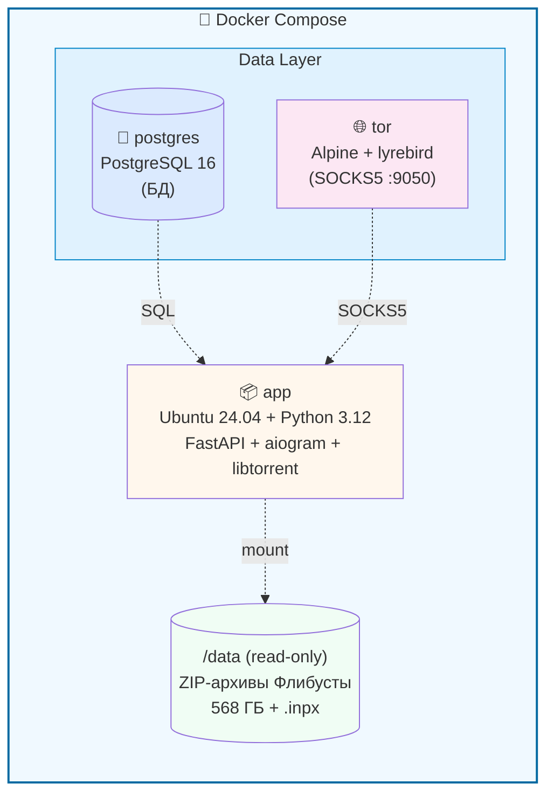

# Book Hub — локальная библиотека FB2 с Telegram-ботом и веб-интерфейсом
## 🤖 Работающий бот

# Book Hub — локальная библиотека FB2 с Telegram-ботом и веб-интерфейсом

[](https://github.com/uud-eparh/books/actions/workflows/ci.yml)
[](LICENSE)
[](https://www.python.org/downloads/)
[](https://www.docker.com/)

Проект развёрнут и доступен в Telegram: **[@flibusta_fb2_bot](https://t.me/flibusta_fb2_bot)**

Попробуйте прямо сейчас — поиск, карточки книг, скачивание.

[](LICENSE)
[](https://www.python.org/downloads/)
[](https://www.docker.com/)

Персональная библиотека на **700 000+ книг** с точечным скачиванием через BitTorrent.
Найдите книгу через веб или Telegram-бота, скачайте нужный `.fb2` — при этом **не нужно хранить всю библиотеку (568 ГБ) локально**.

---

## ✨ Возможности

- 📚 **Каталог на 700 000+ книг** — парсится из `.inpx` Флибусты
- 🔍 **Быстрый поиск** — PostgreSQL FTS + trigram + токенизация (0.7 мс на запрос)
- 👤 **Авторы и серии** — 170 000 авторов с перекрёстными ссылками
- 🎯 **Точечное скачивание через торрент** — только нужный кусок (2–20 МБ вместо 1.7 ГБ)
- 🛒 **Корзина и batch-загрузка** — до 20 книг → один ZIP
- 🤖 **Telegram-бот** — поиск, карточки, скачивание, автор/серия
- 🌐 **Веб-интерфейс** — поиск, скачивание, batch, SSE-прогресс
- 🐳 **Docker** — запуск одной командой, включая Tor для обхода блокировок

---

## 🚀 Быстрый старт

### Требования

- **Docker Desktop** (Windows/macOS/Linux)
- **Git**
- **~1 ГБ** свободного места (образ + БД)
- **Файл `.inpx`** Флибусты (`flibusta_fb2_local.inpx`, ~40 МБ)
- **Торрент с ZIP-архивами** Флибусты (~568 ГБ)

### 1. Клонирование

```bash
git clone https://github.com/uud-eparh/books book-hub
cd book-hub
```

### 2. Настройка окружения

Создай `.env` и `.env.docker`:

```bash
cp .env.example .env
cp .env.example .env.docker
```

**Заполни в обоих:**

- `TELEGRAM_BOT_TOKEN` — токен от [@BotFather](https://t.me/BotFather)
- `TELEGRAM_ALLOWED_USERS` — твой Telegram ID (от [@userinfobot](https://t.me/userinfobot))
- `LIBRARY_PATH` (только в `.env.docker`) — путь к папке с ZIP-архивами
- `INPX_PATH` — путь к `.inpx`-файлу

### 3. Запуск

```bash
docker compose --env-file .env.docker up -d
```

**Первая сборка — 5–15 минут.**

### 4. Первичная инициализация БД

**Один раз** — загрузить книги из `.inpx` в БД:

```bash
# Индексация торрента (метаданные, piece-диапазоны)
docker compose exec app python -m scripts.index_torrent --torrent-id 1

# Загрузка книг (699 504 записи, ~8 минут)
docker compose exec app python -m scripts.load_books \
    --torrent-id 1 --inpx /data/flibusta_fb2_local.inpx

# Индексация ZIP-архивов (699 560 записей, ~2 минуты)
docker compose exec app python -m scripts.index_archives --torrent-id 1
```

### 5. Готово!

- **Веб:** http://localhost:8000
- **Бот:** `@flibusta_fb2_bot` → `/start`

---

## 📖 Подробная документация

| Документ | О чём |
|----------|-------|
| [SETUP.md](docs/SETUP.md) | Подробная инструкция по установке (Windows + Linux + Docker) |
| [ARCHITECTURE.md](docs/ARCHITECTURE.md) | Как устроено: БД, сервисы, потоки данных |
| [TROUBLESHOOTING.md](docs/TROUBLESHOOTING.md) | Типовые проблемы и их решения |
| [API.md](docs/API.md) | HTTP-эндпоинты веб-интерфейса |
| [BOT.md](docs/BOT.md) | Команды и сценарии Telegram-бота |
| [UPDATE.md](docs/UPDATE.md) | Обновление библиотеки, добавление торрентов |

---

## 🏗️ Архитектура (кратко)



**Подробнее:** [ARCHITECTURE.md](docs/ARCHITECTURE.md)

---

## 🧪 Тесты

```bash
# Создать тестовую БД
docker exec -it flibusta_postgres psql -U flibusta -d postgres -c "CREATE DATABASE flibusta_test;"

# Создать схему
python -m scripts.init_test_db

# Запустить тесты
pytest tests/ -v
```

**36 тестов** покрывают парсер `.inpx`, ZIP-reader, транслитерацию, поиск, вычисление piece-ов.

---

## 🛠️ Стек

- **Backend:** Python 3.12, FastAPI, aiogram 3.x
- **БД:** PostgreSQL 16 (FTS, GIN, trigram)
- **Torrent:** libtorrent 2.0.10
- **Frontend:** Jinja2, минимальный CSS, vanilla JS
- **Инфраструктура:** Docker Compose, Tor (WebTunnel-мосты)

---

## 📄 Лицензия

[MIT](LICENSE) — используй как хочешь, модифицируй, продавай.

---

## 🙏 Благодарности

- **Флибуста** — за каталог и раздачу
- **Tor Project** — за WebTunnel-мосты
- **aiogram, FastAPI, SQLAlchemy** — за отличные библиотеки
