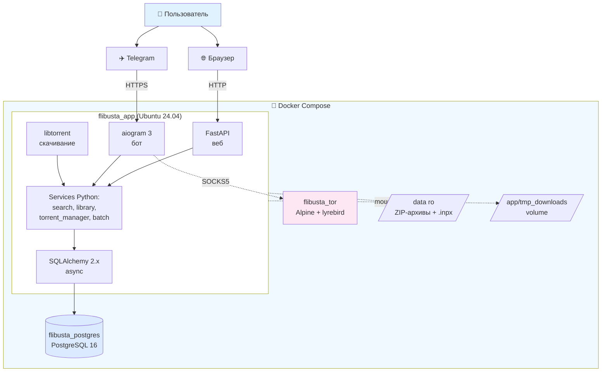
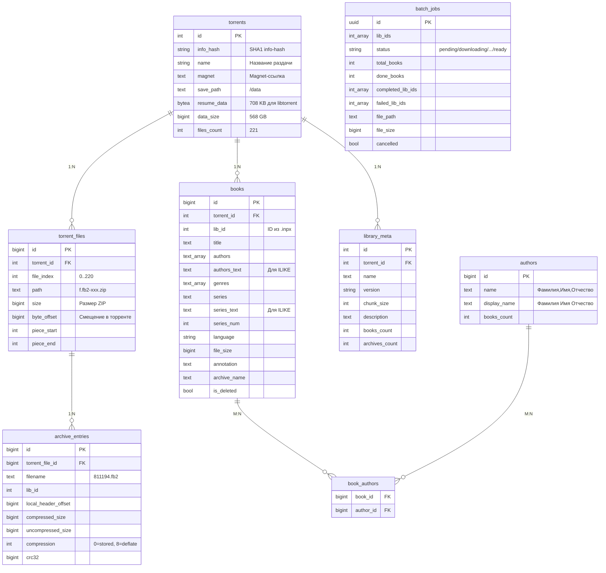
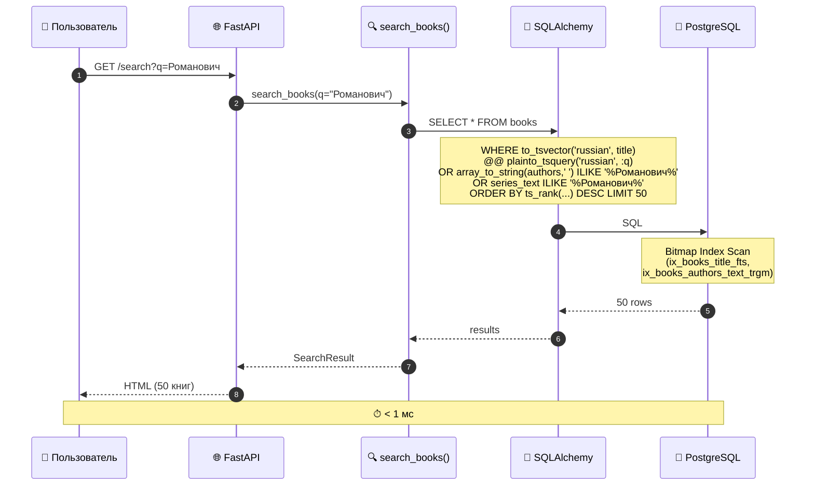
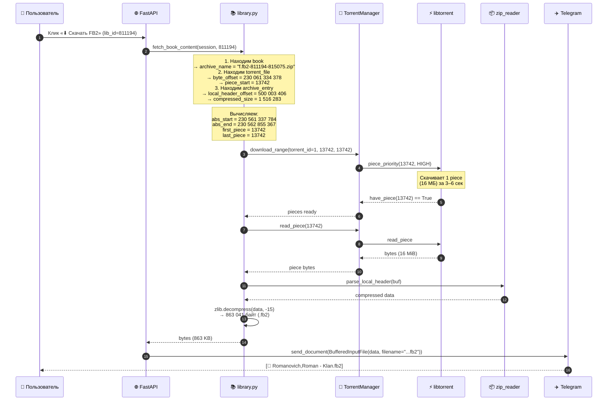
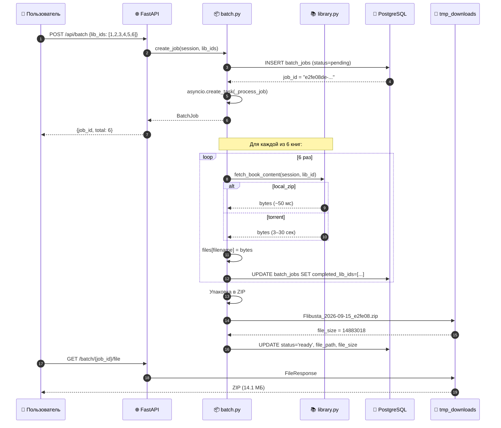

# Архитектура Book Hub

Как устроен проект: компоненты, схема БД, потоки данных.

## 📋 Содержание

1. [Общая схема](#общая-схема)
2. [Компоненты](#компоненты)
3. [Схема БД](#схема-бд)
4. [Потоки данных](#потоки-данных)
5. [Модули приложения](#модули-приложения)
6. [Хранение данных](#хранение-данных)
7. [Безопасность](#безопасность)

---

## Общая схема

---

## Компоненты

### `flibusta_app`

**Главный контейнер.** Ubuntu 24.04 + Python 3.12 + libtorrent 2.0.10.

**Внутри:**
- **FastAPI** — HTTP-сервер на `:8000`
- **aiogram 3** — Telegram-бот (long polling через SOCKS5)
- **libtorrent** — скачивание кусков торрента
- **SQLAlchemy 2 (async)** — работа с PostgreSQL

**Запуск:** `uvicorn app.main:app` → в `lifespan` стартуют `TorrentManager` и `aiogram` polling.

### `flibusta_postgres`

**PostgreSQL 16** в Alpine. Хранит:
- **Книги** (`books`)
- **Авторы** (`authors`, `book_authors`)
- **Торренты** (`torrents`, `torrent_files`)
- **Оглавления ZIP** (`archive_entries`)
- **Batch-задачи** (`batch_jobs`)
- **Метаданные** (`library_meta`)

**Порты:** `5432` проброшен наружу (для локальной разработки и тестов).

### `flibusta_tor`

**Tor-прокси** для обхода блокировок Telegram API.

**Образ:** Alpine + Tor + **lyrebird** (WebTunnel-транспорт).

**Порты:** `9050` (SOCKS5) — **только внутри Docker-сети**, `9051` (Control).

**Зачем:** Telegram API **заблокирован** в РФ. Tor **маскирует трафик** под HTTPS.

---

## Схема БД

### ER-диаграмма

### Таблицы — подробно

#### `torrents`

**Реестр торрентов.**

| Поле | Тип | Описание |
|------|-----|----------|
| `id` | INTEGER PK | |
| `info_hash` | VARCHAR(40) | SHA1 info-hash |
| `name` | VARCHAR(500) | Название раздачи |
| `magnet` | TEXT | Magnet-ссылка |
| `save_path` | TEXT | Путь к данным (`/data`) |
| `resume_data` | BYTEA | Resume-данные libtorrent (708 КБ) |
| `data_size` | BIGINT | 568 ГБ |
| `files_count` | INTEGER | 221 |
| `version` | VARCHAR(64) | Версия `.inpx` |

#### `torrent_files`

**Файлы внутри торрента (ZIP-архивы).**

| Поле | Тип | Описание |
|------|-----|----------|
| `id` | BIGINT PK | |
| `torrent_id` | INTEGER FK | → `torrents.id` |
| `file_index` | INTEGER | Индекс в торренте (0..220) |
| `path` | TEXT | `f.fb2-811194-815075.zip` |
| `size` | BIGINT | Размер ZIP |
| `byte_offset` | BIGINT | Смещение от начала торрента |
| `piece_start` | INTEGER | Первый piece |
| `piece_end` | INTEGER | Последний piece |

**UNIQUE:** `(torrent_id, file_index)`, `(torrent_id, path)`.

#### `archive_entries`

**Файлы внутри ZIP-архивов** (`.fb2`).

| Поле | Тип | Описание |
|------|-----|----------|
| `id` | BIGINT PK | |
| `torrent_file_id` | BIGINT FK | → `torrent_files.id` |
| `filename` | TEXT | `811194.fb2` |
| `lib_id` | INTEGER | ID книги |
| `local_header_offset` | BIGINT | Смещение в ZIP |
| `compressed_size` | BIGINT | Размер сжатых данных |
| `uncompressed_size` | BIGINT | Размер распакованного |
| `compression` | INTEGER | 0=stored, 8=deflate |
| `crc32` | BIGINT | Контрольная сумма |

**UNIQUE:** `(torrent_file_id, filename)`.

#### `books`

**Каталог книг** (699 504 записи).

| Поле | Тип | Описание |
|------|-----|----------|
| `id` | BIGINT PK | |
| `torrent_id` | INTEGER FK | → `torrents.id` |
| `lib_id` | INTEGER | ID из `.inpx` |
| `title` | TEXT | Название |
| `authors` | TEXT[] | `["Джейн,О. О."]` |
| `authors_text` | TEXT | `"Джейн,О. О."` (для ILIKE) |
| `genres` | TEXT[] | Жанры |
| `series` | TEXT | Серия |
| `series_text` | TEXT | Серия (для ILIKE) |
| `series_num` | INTEGER | Номер в серии |
| `language` | VARCHAR(16) | `ru` |
| `file_size` | BIGINT | Размер `.fb2` |
| `annotation` | TEXT | Аннотация |
| `archive_name` | TEXT | `f.fb2-811194-815075.zip` |
| `is_deleted` | BOOLEAN | Удалена из Флибусты |

**Индексы:**
- **GIN** `to_tsvector('russian', title)` — FTS
- **GIN** `authors` — массив
- **GIN** `genres` — массив
- **GIN trigram** `authors_text`, `series_text`, `annotation`, `title`
- **B-tree** `lib_id`, `(torrent_id, archive_name)`, `language`, `is_deleted`

#### `authors`, `book_authors`

**Авторы** (170 000) и связь M:N с книгами.

| `authors.name` | `display_name` | `books_count` |
|---------------|---------------|---------------|
| `Романович,Роман` | `Романович Роман` | 243 |

#### `batch_jobs`

**Пакетная загрузка** (20 книг → ZIP).

| Поле | Описание |
|------|----------|
| `id` | UUID |
| `lib_ids` | INTEGER[] — список книг |
| `status` | `pending` / `downloading` / `packing` / `ready` / `error` / `cancelled` |
| `completed_lib_ids` | Успешно скачанные |
| `failed_lib_ids` | Не скачанные |
| `file_path` | Путь к ZIP |
| `file_size` | Размер ZIP |

---

## Потоки данных

### 1. Поиск книги

### 2. Скачивание через торрент (точечное)

### 3. Batch-загрузка,

---

## Модули приложения

### `app/services/`

| Модуль | Ответственность |
|--------|-----------------|
| `search.py` | FTS + trigram + токенизация |
| `authors.py` | Работа с авторами (поиск, пагинация) |
| `library.py` | `fetch_book_content` — local_zip / torrent |
| `torrent_session.py` | Обёртка над libtorrent-сессией |
| `torrent_manager.py` | Singleton + очередь задач |
| `torrent_fetcher.py` | Точечное скачивание + распаковка |
| `zip_reader.py` | Чтение `.fb2` из ZIP по offset |
| `batch.py` | Пакетная загрузка (20 книг → ZIP) |
| `filenames.py` | Транслитерация, sanitize, уникальность |
| `progress.py` | ProgressTracker для SSE |
| `temp_cleaner.py` | LRU-кэш временных ZIP |

### `app/parsers/`

| Модуль | Ответственность |
|--------|-----------------|
| `inpx.py` | Парсер `.inpx` |
| `torrent.py` | Метаданные торрента через libtorrent |
| `zip_indexer.py` | Сканирование ZIP (оглавление) |

### `app/web/`

| Модуль | Ответственность |
|--------|-----------------|
| `routes.py` | HTTP-эндпоинты (FastAPI) |
| `deps.py` | Зависимости (сессия БД, пагинация) |
| `template_filters.py` | Jinja2-фильтры (нормализация, размер) |

### `app/bot/`

| Модуль | Ответственность |
|--------|-----------------|
| `main.py` | Создание Bot + Dispatcher |
| `middlewares.py` | Whitelist + логирование |
| `handlers/start.py` | `/start`, `/help`, `/about` |
| `handlers/search.py` | Поиск по тексту |
| `handlers/book.py` | Карточка книги |
| `handlers/download.py` | Скачивание `.fb2` |
| `handlers/author.py` | Список книг автора + пагинация |
| `handlers/series.py` | Список книг серии |
| `keyboards.py` | Инлайн-клавиатуры |
| `formatters.py` | Форматирование текста |

---

## Хранение данных

### Постоянные данные

| Данные | Где | Размер | Backup |
|--------|-----|--------|--------|
| **PostgreSQL** | `volume: postgres_data` | ~1 ГБ | `pg_dump` |
| **ZIP-архивы** | `/data` (mount с хоста) | 568 ГБ | Уже на хосте |
| **`.inpx`** | `/data` | 40 МБ | Уже на хосте |

### Временные данные

| Данные | Где | TTL |
|--------|-----|-----|
| **Скачанные `.zip`** | `/app/tmp_downloads` | Удаляются при >20 ГБ (LRU) |
| **Batch-ZIP** | `/app/tmp_downloads` | Удаляются через 10 мин (TTL) |
| **Resume-данные** | `torrents.resume_data` (BYTEA) | Постоянно |

---

## Безопасность

### Whitelist

**`TELEGRAM_ALLOWED_USERS`** — список ID через запятую.

**Если пусто** — бот **публичный** (любой может пользоваться).

**Middleware** проверяет `user.id` **до** обработки команды.

### Пароли

**PostgreSQL** — `POSTGRES_PASSWORD` в `.env`. **Не коммитится** (в `.gitignore`).

**Telegram-токен** — `TELEGRAM_BOT_TOKEN`. **Никогда не публиковать.**

**При компрометации** — `/revoke` в `@BotFather`.

### Tor

**Tor-контейнер** не пробрасывает `9050` наружу — только **внутри Docker-сети**. **Безопасно.**

### SQL-инъекции

**SQLAlchemy** использует **параметризованные запросы**. **Прямых конкатенаций** нет.

**Исключение:** `search.py` собирает **`where`-условия** программно, но через **SQLAlchemy-выражения** — тоже **безопасно**.

---

## См. также

- **[SETUP.md](SETUP.md)** — установка
- **[API.md](API.md)** — HTTP-эндпоинты
- **[BOT.md](BOT.md)** — Telegram-бот
- **[TROUBLESHOOTING.md](TROUBLESHOOTING.md)** — проблемы
- **[UPDATE.md](UPDATE.md)** — обновление